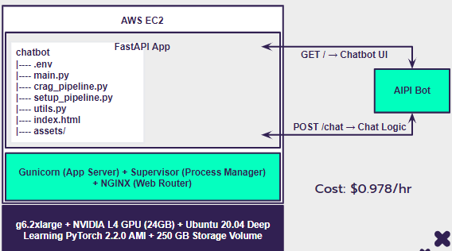
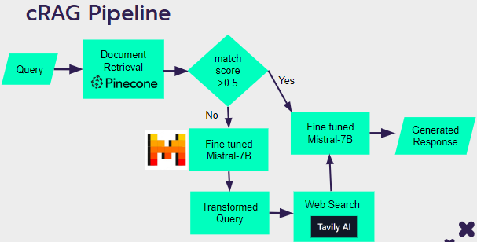

# Fine-tuned-AIPI-FAQ-Chatbot
### We are live 🙌🏼 http://ec2-3-83-33-94.compute-1.amazonaws.com/

## Main Pillars
The three main pillars of or project - 
1. Pinecone
- High speed search and scalability
- Better integration
- Easy Hosting
2. Mistral - 7B
- High Benchmark results
- Efficient Architecture
- Relatively lightweight
3. cRAG
- CRAG based pipeline hooked with tavily search
- Directs questions with low match to web search
- Enhances bots ability to handle out-of-context questions.

## Directory Structure
```
D:.
│   .gitignore
│   README.md
│   requirements.txt
│
├───assets
│       cRAG_pipeline.png
│       Duke_logo.png
│       system_architecture.png
│
├───bot
│   │   crag_pipeline.py
│   │   index.html
│   │   main.py
│   │   README.md
│   │   requirements.txt
│   │   setup_pipeline.py
│   │   utils.py
│   │
│   └───assets
│           Duke_logo.png
│
├───data_scraping
│       webpage_scraping.py
│
├───finetune
│       config-defaults.yaml
│       eval.ipynb
│       finetune.py
│       inference.ipynb
│       merge.py
│       prompts.py
│       README.md
│       requirements.txt
│       utils.py
|
├───notebooks
│       aipi-crag-chatbot.ipynb
│       create_pinecone.ipynb
│       grader_plus_fine-tuned_test.ipynb
|
├───raw_syllabus_data
├───raw_website_data
└───src
        app.py
        crag_pipeline.py
        index.html
        main.py
        setup_pipeline.py
        utils.py
```

## Data
Our three main sources:
1. AIPI FAQ Document
2. Duke AIPI Web domain
- https://ai.meng.duke.edu/
- All subdomains attached to this master domain
3. Syllabus Information for AIPI courses
- Excluding certain ones we did not have access to, i.e. AIPI 560

### Preprocessing
1. Data Selection and Pruning
2. Vectorization and Tokenization - WhereIsAI/UAE-Large-V1
3. Chunking strategy
- Data Integrity and Leakage Prevention

## Finetuning
### Data - Databricks Dolly 15K 
- 15,000 human-generated instruction corpus specifically designed for training conversational AI
- Can be used, modified, and extended for any purpose, including academic or commercial applications
- Split the data as 80-20 for training and test split.

### Model - Mistral-7B-v0.1
- Open-source foundation language model with 7.3B params, outperforming larger models like LLaMA-13B & even LLaMA-34B 
- Efficient architecture with Grouped Query Attention (GQA) and Sliding Window Attention (SWA)
- Adaptability and Customization: Can be fine-tuned for specific domains, industries, or use cases.

#### Configurations
1. ChatML Model
- Don't need Instruct Tags
- Enhanced Format Clarity
- Optimized for RAG

For faster and for using less computation, the following were used - 
2. Bits and Bytes Quantized
- Models are loaded in 4-bit precision to decrease memory usage. 
- Utilizes ‘torch.bfloat16’ for computing, balancing performance and precision.

3. LoRA
Applies to all linear layers, enhancing the model’s ability to adapt.

4. Flash Attention
- Reduced Memory Footprint
- Increased Computational Speed
- Scalability

5. Additional
- Optimized for 1 GPU - Training & Inference 
- Optimizer – Adamw_bnb_8bit

### Results
The total cost for all experiments were ~100$ and Final model cost is ~$7: 
1. Training
- AWS g5.16xlarge
- GPU: Nvidia A10 (24GB)
- All experiments: 24 hrs
- Final model: 103 mins

2. Evaluation
- 1000 random samples
- LLM as Judge –  the LLaMa2-7B model serves as the standard, comparing the outputs generated by the Mistral bot against established ground truth data.
- Accuracy – 82.7% 

## System Architecture 


## Inference - cRAG 


## Evaluation
1. Domain Questions
- 27 catered questions to Duke AIPI
- Subset of data about broad Duke information

2. User Observations
- Response is based on content retrieval from Pinecone & web search
- AIPI specific questions perform better without hitting the web search
- Infrequent yet present hallucination

3. Evaluation
- Human-as-a-Judge
- Rated on 1-5 scale
- Judged on information correctness & response formatting

AIPI Questions: 	2.95/5
Duke Questions: 	2.2/5

**Detailed Evaluation - Chatbot_Evaluation_Questions.csv**

## Cost
1. Experimentation: ~$100 total
2. Model Fine-tuning: ~$7 total
3. AWS Deployment: ~$700/month
4. Pinecone DB: ~$0.45/month
-------------------------------
Total: ~$8455/year

Contributors:
@lesliedees
@mrinoybanerjee
@pallesaisamyukta
@athletedecoded